<div align="center">

```
╔══════════════════════════════════════════════════════════════╗
║                                                              ║
║      🚀  B A C K E N D   →   M L   R O A D M A P            ║
║                                                              ║
║              6 oylik amaliy yo'l xaritasi                    ║
║                                                              ║
╚══════════════════════════════════════════════════════════════╝
```

# Backend to ML: 6 Oylik Roadmap

### Python backend developer'dan ML / MLOps Engineer'gacha — qadam-baqadam yo'l xaritasi

**O'zbek tilida · Praktik · Production-ready · 100% bepul**

<br/>

[](https://www.python.org/downloads/)
[](https://docs.astral.sh/uv/)
[](https://rust-lang.github.io/mdBook/)
[](LICENSE)

[](#)
[](https://github.com/JahongirHakimjonov)
[](#)

<br/>

**[📖 Kitobni o'qish](src/introduction.md)** · **[🚀 Boshlash](#tezkor-boshlash)** · **[💬 Telegram](https://t.me/ja_khan_gir)** · **[👤 Muallif](src/about-author.md)**

---

</div>

<a id="qisqa-statistika"></a>
## 📊 Qisqa statistika

| 📚 Boblar | 📝 Kontent | 🗓️ Davomiyligi | 🏆 Loyihalar | 📖 Lug'at | 💰 Narxi |
|:---:|:---:|:---:|:---:|:---:|:---:|
| **67 ta** | **20,300+ qator** | **6 oy** | **4 capstone** | **200+ termin** | **BEPUL** |

---

<a id="mundarija"></a>
## 📑 Mundarija

1. [Bu nima?](#bu-nima)
2. [Kim uchun mo'ljallangan?](#kim-uchun)
3. [Roadmap (umumiy ko'rinish)](#roadmap)
4. [6 oylik tarkib](#tarkib)
5. [Final loyihalar](#final-loyihalar)
6. [Tezkor boshlash](#tezkor-boshlash)
7. [Loyiha strukturasi](#loyiha-strukturasi)
8. [Texnologiyalar stack](#texnologiyalar)
9. [Nima alohida?](#nima-alohida)
10. [Vaqt taqsimoti](#vaqt-taqsimoti)
11. [FAQ — Tez-tez so'raladigan savollar](#faq)
12. [Hissa qo'shish](#hissa-qoshish)
13. [Muallif](#muallif)
14. [License](#license)

---

<a id="bu-nima"></a>
## 💡 Bu nima?

> *"Backend developer'ning ML'ga yo'li — bu yangi tildan boshlamaslik, balki o'z tilingizning yangi imkoniyatlarini ochish."*

**Backend to ML** — bu **Python backend developer'lar** (Django, DRF, FastAPI bilan ishlovchi) uchun maxsus yaratilgan **6 oylik ML/MLOps roadmap**. Aksariyat ML kurslari data scientist'lar uchun yozilgan — bu kitob esa sizning **production engineering** ko'nikmalaringizdan foydalanib, ML/MLOps Engineer'ga aylanish yo'lini ko'rsatadi.

**Muallif** o'zi shu yo'ldan o'tib kelayotgan inson — o'rganganlarini sistemga keltirib, **o'zbek tilida**, **praktik misollar bilan** taqdim etadi.

### ✨ Asosiy xususiyatlar

|  |  |
|---|---|
| 🇺🇿 | **O'zbek tilida** — texnik terminlar inglizcha qoldirilgan |
| 🎯 | **Backend dev fokus** — har bobda "FastAPI/Django integratsiyasi" bo'limi |
| 💻 | **Code maximum, theory minimum** — har bob 2-3 minimal misol + notebook'lar |
| 🏗️ | **Production-oriented** — MLOps har oyda mavjud, faqat oxirgi oyda emas |
| 🆕 | **2026 yil stack** — uv, PyTorch 2.4+, Claude 4.7, LlamaIndex, MLflow 2.16+ |
| 🏋️ | **3 darajadagi mashqlar** — Easy / Medium / Hard, har bobda |
| 🚀 | **4 ta portfolio loyiha** — GitHub'ga commit qiladigan real ishlar |

---

<a id="kim-uchun"></a>
## 🎯 Kim uchun mo'ljallangan?

### ✅ Bu kitob siz uchun, agar:

- Python sintaksisini yaxshi bilasiz (OOP, decorators, async/await, type hints)
- Django, DRF yoki FastAPI bilan **production'da kamida 1 yil** ishlagansiz
- Docker, PostgreSQL, Redis, Celery bilan tanishsiz
- Git, REST API, asosiy Linux buyruqlarni bilasiz
- ML/MLOps Engineer bo'lishni xohlaysiz

### ❌ Bu kitob siz uchun emas, agar:

- Python'ni endi o'rganmoqdasiz → avval [LearnPython.org](https://www.learnpython.org/) yoki "Python Crash Course"
- Faqat data analysis qiziq → "Python for Data Analysis" (Wes McKinney) yetadi
- ML researcher bo'lishni xohlaysiz → CS229/CS231n + chuqur matematika kerak

### 💭 Matematika kerakmi?

**Maktab darajasidagi matematika yetarli.** Kitob 1-oyda math asoslarini ML kontekstida o'rgatadi (linear algebra, calculus, statistika — faqat kerakli qismi).

---

<a id="roadmap"></a>
## 🗺️ Roadmap (umumiy ko'rinish)

```mermaid
flowchart LR
    Start([🎓 Backend Dev]) --> M1
    M1[📅 Oy 1<br/>Foundations<br/>Math + NumPy/Pandas] --> M2
    M2[📅 Oy 2<br/>Klassik ML<br/>Scikit-learn + XGBoost] --> M3
    M3[📅 Oy 3<br/>Deep Learning<br/>PyTorch + CNN/RNN] --> M4
    M4[📅 Oy 4<br/>CV + NLP<br/>YOLO + Transformers] --> M5
    M5[📅 Oy 5<br/>LLM + RAG<br/>OpenAI + Anthropic + LangChain] --> M6
    M6[📅 Oy 6<br/>MLOps<br/>MLflow + DVC + Airflow + K8s] --> End
    End([🚀 ML/MLOps Engineer])

    style Start fill:#4a90e2,color:#fff
    style End fill:#27ae60,color:#fff
    style M1 fill:#f39c12,color:#fff
    style M2 fill:#e67e22,color:#fff
    style M3 fill:#9b59b6,color:#fff
    style M4 fill:#3498db,color:#fff
    style M5 fill:#1abc9c,color:#fff
    style M6 fill:#e74c3c,color:#fff
```



---

<a id="tarkib"></a>
## 📚 6 oylik tarkib

### Oy 1 — Foundations

[📖 Bobni ochish](src/month-01-foundations/README.md)

Math asoslari + Python ML toolkit'ini egallash.

| Texnologiyalar | Capstone |
|---|---|
| `NumPy` `Pandas` `Matplotlib` `Seaborn` `SciPy` `SymPy` | EDA report — Titanic yoki House Prices |

---

### Oy 2 — Klassik ML

[📖 Bobni ochish](src/month-02-classical-ml/README.md)

Scikit-learn ekosistemasi: regression, classification, clustering, ensembles.

| Texnologiyalar | Capstone |
|---|---|
| `scikit-learn` `XGBoost` `LightGBM` `CatBoost` `Optuna` `SHAP` | Kaggle competition (top 30%) |

---

### Oy 3 — Deep Learning

[📖 Bobni ochish](src/month-03-deep-learning/README.md)

Neural networks asoslari + PyTorch'da to'liq pipeline + transfer learning.

| Texnologiyalar | Capstone |
|---|---|
| `PyTorch` `TensorFlow/Keras` `timm` `W&B` `Albumentations` | CIFAR-10 classifier (85%+) |

---

### Oy 4 — CV + NLP

[📖 Bobni ochish](src/month-04-cv-nlp/README.md)

Computer Vision (OpenCV, YOLO, OCR) + NLP (spaCy, Transformers).

| Texnologiyalar | Capstone |
|---|---|
| `OpenCV` `YOLO v8/v11` `PaddleOCR` `spaCy` `HuggingFace` | Custom YOLO + OCR servis |

---

### Oy 5 — LLM + RAG

[📖 Bobni ochish](src/month-05-llm-rag/README.md)

LLM API'lar, prompt engineering, RAG pipeline, AI agentlar, fine-tuning.

| Texnologiyalar | Capstone |
|---|---|
| `OpenAI` `Anthropic` `LangChain` `LlamaIndex` `Qdrant` `LoRA` | O'zbek hujjatlar RAG chatbot |

---

### Oy 6 — MLOps + Production

[📖 Bobni ochish](src/month-06-mlops-production/README.md)

End-to-end production ML: experiment tracking, deployment, monitoring.

| Texnologiyalar | Capstone |
|---|---|
| `MLflow` `DVC` `FastAPI` `Docker` `K8s` `Airflow` `Evidently` | To'liq MLOps pipeline |

---

### Har bobda standart 10 ta bo'lim

```
🎯 Maqsad → 📖 Nimani o'rganish → 📦 Kutubxonalar → 🧠 Muhim mavzular →
💻 Kod misollari → 🔌 Backend integratsiyasi → 📚 Resurslar → 
🏋️ Mashqlar (Easy/Medium/Hard) → 🚀 Capstone → ✅ Tekshirish ro'yxati
```

---

<a id="final-loyihalar"></a>
## 🏆 Final loyihalar

6 oy davomida quyidagi **4 ta portfolio loyiha** GitHub'da to'planadi — bular sizning **CV**ngiz, **LinkedIn post**laringiz va **interview material**ingiz bo'ladi.

### 1️⃣ Prediction API

[📖 Brief](src/final-projects/project-1-prediction-api.md) · **Vakansiya:** Junior ML Engineer

Klassik ML model + production-ready backend.

**Stack:** FastAPI + Postgres + Redis + Docker + MLflow

---

### 2️⃣ Computer Vision Service

[📖 Brief](src/final-projects/project-2-cv-service.md) · **Vakansiya:** CV Engineer

YOLO + async video processing + S3 storage.

**Stack:** YOLOv8 + FastAPI + Celery + S3/MinIO + GPU Docker

---

### 3️⃣ RAG Chatbot

[📖 Brief](src/final-projects/project-3-rag-chatbot.md) · **Vakansiya:** AI/GenAI Engineer

O'zbek hujjatlar uchun LLM-powered chatbot.

**Stack:** Anthropic/OpenAI + Qdrant + LangChain + Streamlit + Langfuse

---

### 4️⃣ End-to-End MLOps Pipeline ⭐

[📖 Brief](src/final-projects/project-4-mlops-pipeline.md) · **Vakansiya:** MLOps Engineer

Sizning **eng katta** portfolio loyihangiz — to'liq production ML platform.

**Stack:** DVC + MLflow + Airflow + K8s + Prometheus + Evidently + CI/CD

---

<a id="tezkor-boshlash"></a>
## 🚀 Tezkor boshlash

### 1️⃣ Kitobni o'qish (mdBook)

```bash
# mdBook o'rnatish
brew install mdbook
# yoki: cargo install mdbook

# Loyihaga kirish
cd backend_to_ml

# Lokal serverda ochish (avtomatik brauzerda)
mdbook serve --open
```

Brauzer **http://localhost:3000** da kitob ochiladi. Live-reload bilan ishlaydi.

---

### 2️⃣ Notebook'lar bilan ishlash (uv)

<details>
<summary><b>📦 uv o'rnatish (bir marta)</b></summary>

```bash
# Mac / Linux
curl -LsSf https://astral.sh/uv/install.sh | sh

# yoki Homebrew
brew install uv

# Windows
powershell -c "irm https://astral.sh/uv/install.ps1 | iex"

# Tekshirish
uv --version
```

</details>

```bash
# Faqat bitta oy uchun (eng tavsiya)
uv sync --group month-01

# Jupyter Lab ishga tushirish (uv venv'da)
uv run jupyter lab
```

<details>
<summary><b>📋 Barcha oylar uchun buyruqlar</b></summary>

```bash
uv sync --group month-01    # Foundations
uv sync --group month-02    # Klassik ML
uv sync --group month-03    # Deep Learning
uv sync --group month-04    # CV + NLP
uv sync --group month-05    # LLM + RAG
uv sync --group month-06    # MLOps

# GPU uchun PyTorch (NVIDIA + Linux/Windows)
uv sync --group month-03 --index pytorch-cu121

# Streamlit/Gradio demo'lar
uv sync --group demo

# Hammasini birga (~10 GB disk)
uv sync --all-groups
```

</details>

---

### 3️⃣ Environment sozlash

```bash
# .env yaratish (LLM API keys uchun)
cp .env.example .env
# Tahrir qiling — kerakli API key'larni qo'shing
```

---

### 4️⃣ Ishni boshlash 🎉

[**Oy 1 — Foundations**](src/month-01-foundations/README.md) bilan boshlang!

---

<a id="loyiha-strukturasi"></a>
## 📁 Loyiha strukturasi

<details>
<summary><b>📂 To'liq tarkibni ko'rsatish</b></summary>

```
backend_to_ml/
├── 📄 README.md                  # Bu fayl
├── 📄 LICENSE                    # MIT
├── 📄 book.toml                  # mdBook konfiguratsiyasi
├── 📄 pyproject.toml             # uv/Python paketlar (PEP 735 groups)
├── 📄 .python-version            # Python 3.11
├── 📄 .env.example               # Environment namuna
├── 📄 .gitignore
│
├── 📂 src/                       # 67 ta markdown bob
│   ├── 📄 SUMMARY.md             # Kitob navigatsiyasi
│   ├── 📄 introduction.md        # Kirish
│   ├── 📄 about-author.md        # Muallif haqida
│   ├── 📄 glossary.md            # 200+ termin lug'ati
│   │
│   ├── 📂 month-01-foundations/        # 6 fayl
│   │   ├── 01-math-basics.md
│   │   ├── 02-numpy.md
│   │   ├── 03-pandas.md
│   │   ├── 04-matplotlib-seaborn.md
│   │   ├── 05-eda-project.md
│   │   └── exercises.md
│   │
│   ├── 📂 month-02-classical-ml/       # 8 fayl
│   ├── 📂 month-03-deep-learning/      # 7 fayl
│   ├── 📂 month-04-cv-nlp/             # 7 fayl
│   ├── 📂 month-05-llm-rag/            # 9 fayl
│   ├── 📂 month-06-mlops-production/   # 9 fayl
│   │
│   ├── 📂 final-projects/        # 4 portfolio loyiha
│   │   ├── project-1-prediction-api.md
│   │   ├── project-2-cv-service.md
│   │   ├── project-3-rag-chatbot.md
│   │   └── project-4-mlops-pipeline.md
│   │
│   └── 📂 resources/             # Resurslar
│       ├── books.md              # Kitoblar ro'yxati
│       ├── courses.md            # Onlayn kurslar
│       ├── youtube-channels.md   # YouTube kanallar
│       ├── datasets.md           # Datasets
│       └── cheatsheets.md        # Quick reference
│
├── 📂 notebooks/                 # Jupyter notebook'lar
│   ├── README.md                 # Notebook guide (uv bilan)
│   └── month-01/ ... month-06/   # Har oy uchun papka
│
└── 📂 book/                      # mdBook HTML output (build natijasi)
```

</details>

---

<a id="texnologiyalar"></a>
## ⚙️ Texnologiyalar stack

### Oy bo'yicha asosiy texnologiyalar

| Oy | Asosiy texnologiyalar |
|----|----------------------|
| **1** | NumPy · Pandas · Matplotlib · Seaborn · SciPy · SymPy |
| **2** | scikit-learn · XGBoost · LightGBM · CatBoost · Optuna · SHAP · Imbalanced-learn |
| **3** | PyTorch · TensorFlow/Keras · timm · Weights & Biases · Albumentations · TensorBoard |
| **4** | OpenCV · YOLO v8/v11 · Ultralytics · Supervision · MediaPipe · PaddleOCR · EasyOCR · spaCy · NLTK · HuggingFace Transformers · sentence-transformers |
| **5** | OpenAI · Anthropic · Google AI · Groq · LangChain · LlamaIndex · LangGraph · Langfuse · Instructor · Pydantic AI · CrewAI · Qdrant · ChromaDB · pgvector · PEFT · TRL |
| **6** | MLflow · DVC · Prefect · Apache Airflow · BentoML · ONNX · Evidently AI · Great Expectations · FastAPI · Docker · Kubernetes · Helm · Prometheus · Grafana |

### Dev / Production stack (har doim)

```
Backend:    FastAPI · SQLAlchemy · Pydantic v2 · Celery · Redis
Database:   PostgreSQL · pgvector · Redis
Storage:    S3 / MinIO · DVC
Container:  Docker · docker-compose · Kubernetes
CI/CD:      GitHub Actions · CML
Tooling:    uv · ruff · mypy · pytest · pre-commit
```

---

<a id="nima-alohida"></a>
## 🔥 Nima alohida?

### Boshqa kurslar bilan solishtirish

| Mezon | Klassik ML kurslari | Backend to ML |
|---|---|---|
| **Maqsad** | Data Scientist | ML / MLOps Engineer |
| **Yondashuv** | Notebook'da eksperiment | Production system'lar |
| **Til** | Inglizcha | 🇺🇿 O'zbek |
| **Backend integratsiya** | Kamdan-kam | ✅ Har bobda |
| **MLOps** | Oxirgi modul yoki yo'q | ✅ Boshidan oxirigacha |
| **LLM/RAG** | Eski ma'lumot | ✅ 2026 stack |
| **Loyiha tushuntirilishi** | Tugagandan keyin | ✅ Production'a olib chiqish bilan |
| **Mahalliy kontekst** | Yo'q | ✅ O'zbek datasetlar, lex.uz, va h.k. |

### Sizning ustunligingiz (backend dev sifatida)

```
Mavjud bilim                    +    Yangi bilim    =    Result
─────────────                       ─────────────       ──────────
✅ FastAPI, Django               +  ✅ Scikit-learn   =  ML API
✅ Docker, K8s                   +  ✅ MLflow         =  MLOps
✅ PostgreSQL, Redis             +  ✅ Vector DB      =  RAG
✅ Async, Celery                 +  ✅ Streaming      =  LLM apps
✅ CI/CD (GitHub Actions)        +  ✅ DVC + tests    =  ML CI/CD
```

Aksariyat ML kurslari oxiriga yetib, "endi qanday production'ga olib chiqamiz?" deb qoladi. **Siz buni allaqachon bilasiz** — kitob shu ustun bilim asosida quriladi.

---

<a id="vaqt-taqsimoti"></a>
## ⏱️ Vaqt taqsimoti

| Tartib | Kuniga | Davomiyligi | Natija |
|--------|--------|-------------|--------|
| 🌱 **Sekin** | 30-60 daqiqa | 8-9 oy | Tushunish, ozgina mashq |
| ⚖️ **Balanced** ⭐ | 1-2 soat | **6 oy** | To'liq programma + capstone |
| 🚀 **Intensive** | 3+ soat | 4-5 oy | Hamma narsa + ekstra loyihalar |

### Haftalik tartib

```
Mon-Fri:  Yangi material (40 daq.)  +  Mashqlar (40 daq.)
Sat:      Capstone loyihaga ishlash  (3 soat)
Sun:      Review + planning (1 soat) yoki dam olish
```

**Muhim:** har kuni 1 soat ishlash, hafta oxiri 7 soat ishlashdan **yaxshiroq**.

---

<a id="faq"></a>
## ❓ FAQ — Tez-tez so'raladigan savollar

<details>
<summary><b>🤔 Matematika bilmasam ham bo'ladimi?</b></summary>

Ha. Maktab darajasi (linear algebra, asoslar) yetarli. 1-oyda math asoslari ML kontekstida o'rgatiladi — gradient nima, vektor, matritsa, distribution va h.k. Chuqur teoremalar kerak emas.

</details>

<details>
<summary><b>💻 GPU yo'q bo'lsa-chi?</b></summary>

CPU ham yetadi (Oy 1-2 uchun, Oy 5 uchun ham — LLM API ishlatilgan). DL training (Oy 3-4) uchun **bepul Google Colab** (T4 GPU, 12 soat sessiya) yoki **Kaggle Notebooks** (P100, 30 soat/hafta) yetarli.

</details>

<details>
<summary><b>💰 Qancha pul kerak bo'ladi?</b></summary>

- **Asosiy kitob:** 100% bepul
- **Software:** hammasi open source / bepul tier
- **Cloud:** Google Colab + Kaggle bepul
- **LLM API (Oy 5):** $10-20 yetadi (OpenAI/Anthropic mini modellari juda arzon)
- **Kitoblar (ixtiyoriy):** "Designing ML Systems" — $30
- **Hammasi birga:** **$0-50** 6 oyga

</details>

<details>
<summary><b>📅 6 oy ko'p emasmi? Tezroq bo'lmaydimi?</b></summary>

Mumkin, lekin **chuqur o'rganish vaqt talab qiladi**. Intensive (3+ soat/kun) bilan 4 oyda tugatish mumkin. Lekin **production-grade** loyiha qurish va kontseptsiyalarni mustahkamlash uchun 6 oy maqbul.

</details>

<details>
<summary><b>🎓 Sertifikat beriladimi?</b></summary>

Yo'q — bu open source kitob. Lekin yakuniy **4 ta portfolio loyihangiz** har qanday sertifikatdan ko'ra muhimroq bo'ladi. Recruiter'lar GitHub repo'larni ko'rishadi, sertifikat'larni emas.

</details>

<details>
<summary><b>🔧 Qaysi IDE/editor tavsiya?</b></summary>

- **VS Code** + Python + Jupyter extensions (eng yaxshi)
- **PyCharm Professional** (bepul student licence)
- **Cursor** (AI-powered, VS Code fork)

Notebook uchun **Jupyter Lab** (lokal) yoki **VS Code Jupyter** (integrated).

</details>

<details>
<summary><b>🇺🇿 Nima uchun o'zbek tilida?</b></summary>

O'zbekistonda ML/MLOps bo'yicha sifatli **mahalliy** materiallar yetishmaydi. Texnik terminlar inglizchada qoldirilgan — chunki documentation, StackOverflow, GitHub Issues hammasi inglizcha. Lekin tushuntirish ona tilingizda — sezgi va intuition tezroq shakllanadi.

</details>

<details>
<summary><b>🤝 Muallifga qanday savol berishim mumkin?</b></summary>

- 💬 **Eng tezkor:** [Telegram @ja_khan_gir](https://t.me/ja_khan_gir)
- 📧 **Rasmiy:** jahongirhakimjonov@gmail.com
- 🐙 **GitHub Issues:** kontent xatosi yoki taklif uchun
- 💼 **LinkedIn:** hamkorlik yoki ish takliflari uchun

To'liq → [Muallif haqida](src/about-author.md)

</details>

<details>
<summary><b>📚 Kitobni offline o'qish mumkinmi?</b></summary>

Ha. `mdbook build` qiling — `book/` papkasida static HTML chiqadi. Yoki PDF'ga eksport (mdbook plugin kerak: `mdbook-pdf`).

</details>

<details>
<summary><b>🌍 Boshqa tilga tarjima qilsam bo'ladimi?</b></summary>

Ha! MIT license. Fork qiling, tarjima qiling, o'zingiz nomingiz bilan e'lon qiling. Faqat asl muallifni atribut qilish kerak. Pull request orqali asosiy repo'ga ham qaytarish mumkin.

</details>

---

<a id="hissa-qoshish"></a>
## 🤝 Hissa qo'shish

Bu kitob — **jamoaviy ish**. Sizning hissangiz juda muhim!

### Qanday yordam berish mumkin?

| Daraja | Nima qila olasiz |
|--------|------------------|
| ⭐ **Eng oson** | GitHub'da **star** qo'ying — boshqalar topishi uchun |
| 📢 **Oson** | LinkedIn / Telegram'da **ulashing** — `@jahongir-hakimjonov` ni tag qiling |
| 🐛 **O'rtacha** | **Issue oching** — imlo xatosi, eskirgan ma'lumot, taklif |
| 🔧 **Yaxshi** | **Pull Request** — kontent yaxshilash, yangi misol, tarjima |
| 🏆 **Eng yaxshi** | Yangi **bob/loyiha** taklif qilish va yozish |

### Contribution guidelines

```bash
# 1. Fork qiling
# 2. Branch yarating
git checkout -b feature/yangi-bob

# 3. O'zgarishlarni qiling
mdbook serve --open   # lokal preview

# 4. Commit (conventional commits)
git commit -m "docs: add new section on X"

# 5. Push va PR
git push origin feature/yangi-bob
```

---

<a id="muallif"></a>
## 👨‍💻 Muallif

### Jahongir Hakimjonov

*Python Backend Developer → ML/MLOps Engineer*

<br/>

[](https://dev.jakhangir.uz/)
[](https://t.me/ja_khan_gir)
[](mailto:jahongirhakimjonov@gmail.com)

[](https://github.com/JahongirHakimjonov)
[](https://www.linkedin.com/in/jahongir-hakimjonov/)

### Nima uchun bu kitob yozildi?

> Men o'zim shu yo'ldan o'tib kelayotgan inson — backend dev'dan ML/MLOps'ga. O'zbekistonda sifatli mahalliy materiallar yo'qligi va backend developer perspektivasidan yozilgan praktik resurs kerakligi sababli — bu kitobni yaratdim. Birga o'rganamiz! 🚀

**To'liq bio va kontaktlar:** [src/about-author.md](src/about-author.md)

### Mentorlik / Code Review

Agar ML loyihangizda qiyinchilik bo'lsa, **bepul yordam bera olaman**:

- 🔍 **Code review** — kichik loyihalar uchun
- 🏗️ **Architecture consulting** — Django/FastAPI + ML
- 🎯 **Career advice** — backend → ML transition

[Telegram orqali yozing](https://t.me/ja_khan_gir).

---

## 🙏 Minnatdorchilik

Bu kitob ko'plab open source loyihalar va ajoyib insonlar bilan qurilgan:

| Sohasi | Loyihalar va insonlar |
|--------|----------------------|
| **📦 Open Source Stack** | NumPy · Pandas · Scikit-learn · PyTorch · HuggingFace · LangChain · LlamaIndex · MLflow · DVC · FastAPI · Astral (uv, ruff) · Anthropic · OpenAI |
| **🎓 Inspirator o'qituvchilar** | Chip Huyen · Andrew Ng · Andrej Karpathy · Jeremy Howard (fast.ai) · Jay Alammar · Sebastian Raschka · Wes McKinney |
| **🤝 Hamjamiyat** | O'zbek IT community · @uzbekdevs · @uz_ai_community · MLOps Community · HuggingFace · DataTalks.Club |
| **❤️ Sizga** | Kitobni o'qigan, fikr bildirgan, takliflar bergan, ulashgan har bir kishi |

---

<a id="license"></a>
## 📄 License

[MIT License](LICENSE) — bemalol foydalaning, ulashing, o'zgartiring.

- ✅ Tijorat maqsadlarida ham mumkin
- ✅ Forklash va o'zgartirish — erkin
- ✅ Tarjima qilish — qo'llab-quvvatlanadi
- ℹ️ Atribut qoldirish tavsiya etiladi (lekin majburiy emas — MIT)

---

<div align="center">

### 💫 Agar bu kitob sizga foydali bo'lsa

⭐ **Star qo'ying** · 📢 **Do'stlaringizga ulashing** · 💬 **Fikr bildiring**

<br/>

```
╔══════════════════════════════════════════════════════════════╗
║                                                              ║
║         🌟 Made with ❤️ in Tashkent · 2026                  ║
║                                                              ║
║         Backend to ML — sizning safaringiz boshlanadi        ║
║                                                              ║
╚══════════════════════════════════════════════════════════════╝
```

<br/>

**[📖 Boshlash →](src/introduction.md)** · **[💬 Telegram](https://t.me/ja_khan_gir)** · **[🌐 Website](https://dev.jakhangir.uz/)**

</div>
